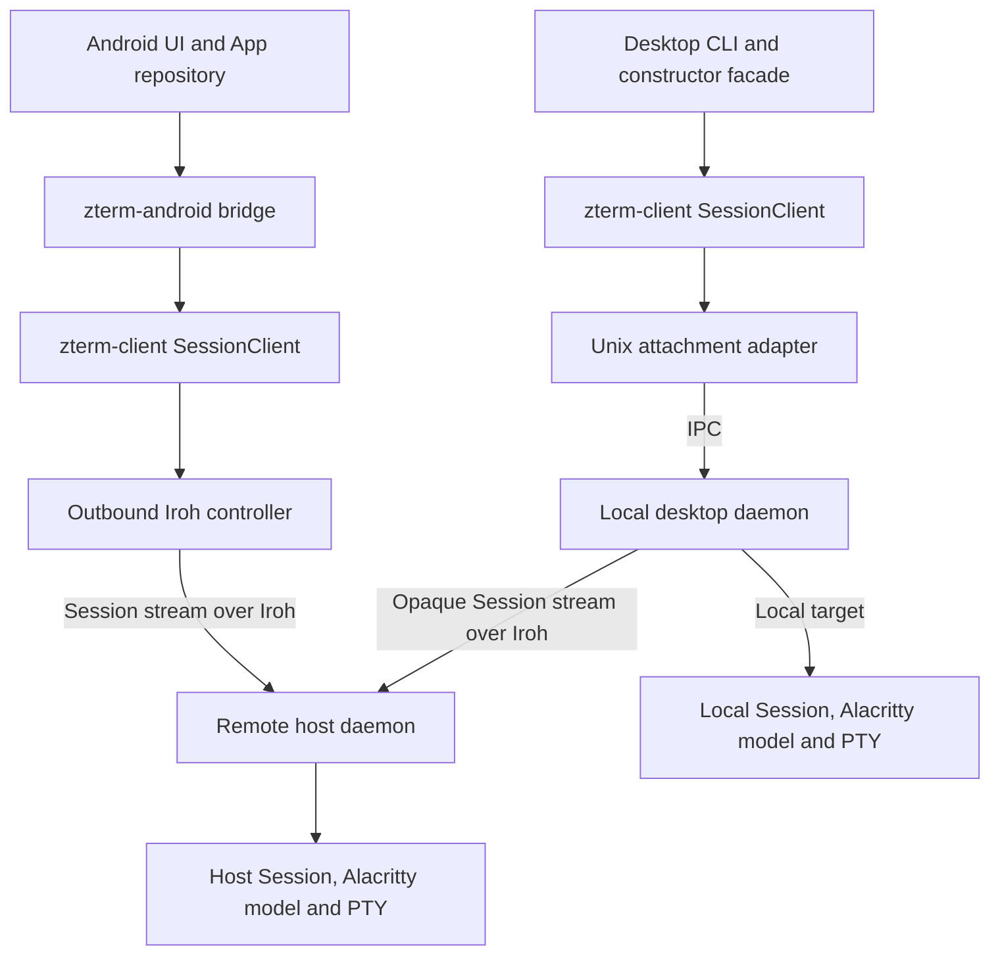

# Android App Design

Status: approved on 2026-09-07; refreshed against mainline `de25a38` (`0.1.24`).
Implementation is in progress; see `research/implementation-progress.md`.
Requirements and acceptance are owned by `prd.md`; execution is in `implement.md`.
Source evidence and dependency publication checks are in
`research/build-and-client-boundary.md`; scanner details are in
`research/qr-pairing.md`; Session management and native scrolling/selection
evidence is in `research/session-selection-scroll.md`.

## 1. Shape and Boundaries

Use Kotlin with Jetpack Compose for navigation, pairing, lists, and the shortcut
bar. Embed a custom Android `View` for the terminal grid and its `InputConnection`.
Use Rust for the existing Zterm protocol, authentication, attachment lifecycle,
semantic state, and input encoding, exposed through generated UniFFI bindings.

This keeps Android camera/IME/lifecycle integration native and preserves the
Rust protocol owner. A WebView/ANSI terminal would duplicate the host terminal
model; a cross-platform UI framework adds a platform boundary without a second
mobile deliverable in this task. Neither is selected.



Planned locations:

| Location | Responsibility |
| --- | --- |
| `apps/android/` | Gradle wrapper, Android App, generated-source integration, instrumentation tests |
| `crates/client/` (`zterm-client`) | Shared Session client/state machine, unary mutation/replay owner, typed events/errors, outbound pairing and normal handshake components, Iroh controller adapter |
| `crates/android/` (`zterm-android`) | `cdylib`/`rlib`, runtime ownership, UniFFI API, semantic frame/history/selection owner |
| `crates/daemon/src/client/` | Existing desktop API facade and concrete Unix IPC/tunnel/lifecycle adapters |
| `crates/core/`, `crates/proto/` | Shared domain/input values, bounded multi-page cache and content-range extensions; existing protobuf v2 contracts |
| `crates/cli/` | Existing desktop presentation plus explicit host QR output |
| `tools/android/`, `docs/android.md` | Reproducible build/bindings/signing entry points and operator instructions |

Android must have no dependency path to `zterm-daemon`, `zterm-platform`,
`zterm-terminal`, `alacritty_terminal`, or the desktop ANSI presenter. Extend the
existing dependency-policy owner to check the new client and bridge crates.
Do not solve this by linking the daemon behind broad feature flags.

One task owns this integrated first-release flow. The extraction, QR output,
and App are ordered milestones, not independently accepted products. Reuse the
existing host-validation task as a prerequisite rather than creating a second
owner for its acceptance matrix.

## 2. Shared Client Extraction

`crates/daemon/src/client/session.rs` already owns attachment epochs, request
correlation, exact snapshot acknowledgements, replay boundaries, and reconnect.
Its current concrete transport opens a Unix socket even for remote attachments
(`client/transport.rs`). Extract its protocol behavior into `zterm-client`;
keep socket paths, daemon restart capability, tunnel envelopes, and local
diagnostics in the desktop adapter. Preserve old imports through a narrow
facade while migrating current callers and tests.

Introduce only the needed transport factory: open a target Session stream and
perform the existing unary/operation-lease calls for that target, with a fixed
deadline and typed failures. Local IPC and opaque remote tunnel adapters feed
the same decoded Session frames as the Android Iroh adapter. Address-free path
observations are adapter events; `TerminalTransportStateEvent` and local tunnel
wire kinds must never be sent to a remote normal-ALPN stream.

Move the renderer-independent list/create/rename/close request handling and
per-target operation-lease/replay policy from `client/ipc.rs` into the same
shared client. Keep local-only management commands in the daemon facade. Use
the existing v2 Session requests and exact target/Session IDs; Kotlin never
allocates wire operation IDs or retries a mutation by rebuilding its request.

Remove accidental reverse dependencies during extraction: shared Session
summaries and target identifiers become domain DTOs; protocol errors retain
`DomainErrorKind` through a shared client error, mapped by the daemon facade.
`RemoteDaemonRestarter` remains an injected desktop-only capability. Keep host
Session execution and host-side authorization/store actors in the daemon.

For authentication, factor the controller transcript/exchange and
Hello/Welcome validation from `pairing_service.rs`, `pairing.rs`,
`pair_framing.rs`, and `connection_broker.rs` into shared client components.
Pass bounded authenticated duplex streams and typed identity/route values;
do not copy the complete broker, inbound registry, or daemon store into Android.
The existing desktop path must call the extracted behavior, avoiding two
independent implementations of one-time pairing and identity checks.

Android owns one Iroh Endpoint per App process and a bounded connection entry
per used host. Pairing uses `zterm-pair/2`; normal authenticated calls use
`zterm/2`. Reuse the connection for listing, attachment, and confirmation when
valid. Outbound controller behavior does not expose an Android host service.
Keep the existing official-n0 and authenticated relay-hint behavior; no new
relay service, discovery backend, TLS bypass, or mobile-specific wire format.
Preserve Iroh 1.0.3. Keep desktop-only port mapping out of the mobile dependency
feature graph when separating the current infrastructure builder.

## 3. App Runtime and FFI Contract

An Application-scoped repository owns one Rust runtime handle. Screen/ViewModel
collectors can attach and detach without destroying the runtime or Session.
Do not put the connection owner inside `repeatOnLifecycle`, a Composable
effect, or an Activity teardown callback. Native drawing and camera capture
still follow their normal visibility lifecycle.

The UniFFI facade uses typed records/enums and async operations, with operations
equivalent to initialization, pairing, host/session lists, create/rename/close,
attach, explicit takeover, input, resize, detach, history targets/return-live,
selection start/update/copy/cancel, foreground reconciliation, and latest-state
observation. This is an in-process interface, not another wire protocol.
Carry Session/attachment identity and a monotonic local generation with events;
drop results from retired views or canceled scan attempts.

UniFFI converts async Rust calls to Kotlin suspend functions, but cancellation
must be explicit: expose cancellation by operation/view handle. Canceling a UI
collector must not cancel the active terminal connection. Use the Rust-owned
Tokio runtime deliberately; do not assume a Kotlin coroutine supplies Tokio's
reactor. The initial build gate must verify initialization, async completion,
explicit cancellation, exception translation, and native-object disposal.

Maintain one bounded latest-state notification and one immutable complete
render-frame slot. Rust validates/applies snapshots and deltas transactionally,
then acknowledges the exact revision. Kotlin acquires the current complete
frame at native display cadence and draws that frame without per-cell FFI calls.
Do not acknowledge a revision before a complete client-owned state exists;
never merge across attachment generations. Rendering suspension must not hold
the protocol acknowledgement owner hostage to a stopped Activity.

Separate applied live protocol state from the last presented frame: history or
selection may intentionally retain a different complete viewport. Carry its
frame token, source identity, scroll metrics, and overlay generation together.
The Android View reports successful drawing of that exact token. Hit testing,
selection, and visible scroll position use that presented token, never an
unpainted cache target. Reject stale frame acknowledgements or gesture tokens
after attachment replacement; protocol ACK does not imply pixels were drawn.

The shared client retains its existing bounded control queues and contiguous
revision rules. Do not discard an intermediate delta unless the retained full
state incorporates it, and do not turn a notification slot into an unbounded
frame backlog. An incompatible delta requests synchronization rather than
displaying a guessed surface.

## 4. Pairing and Session Management

App navigation is `known hosts -> terminal`, with Session selection expanded
on demand from the terminal title. There is no standalone Session route.
A known prior Session restores by exact ID. Without a previous ID, a sole
Session is the target; several Sessions enter the terminal container with its
title list already expanded; zero Sessions show explicit New Session. A stale
recorded ID shows ended and requires explicit selection/creation. Do not silently
substitute an ID or skip occupied takeover confirmation. This keeps ordinary
device resume taps direct and introduces no standalone Session route.
Successful pairing saves the host and continues toward its terminal, subject
to the same target/empty/occupied rules. Creation and takeover stay explicit.

Home has a settings icon, conditional top resume card, saved-host cards, and
Add host. It has no Android badge, large heading, or slogan. Settings contains
independent Language and Theme groups, terminal font size, and About.
The scan screen uses only a short title and the two bottom entry labels.
Keep all other screen copy terse, with errors and destructive consequences
expressed in the shortest useful form.

### Language and theme preferences

Store App-local preferences: language `system / zh / en` and theme
`system / dark / light`, both defaulting to `system`. Apply immediately on
selection and retain across navigation and process restart; no Save button.
System mode remains a preference, not a one-time copy of the current OS value.
Resolve supported system locales with English fallback, and update system theme
when the device changes appearance. Explicit overrides ignore the corresponding
OS changes. The Penpot system example resolves to Chinese and dark.

Use localized App resources for chrome, validation, accessibility, and dialogs;
do not translate remote output, credentials, names, or paths. Use semantic
colors for light/dark App surfaces, text, selections, dialogs, shortcut keys,
terminal default foreground/background, and system-bar icon contrast. Keep
explicit terminal ANSI/truecolor cell values intact. This is not a custom
palette editor. Preference updates must preserve the retained connection owner,
paired hosts, current Session, scroll anchor, cache, and semantic selection;
they are not a detach/reconnect or an input event. Android recreation must
reattach to that retained owner rather than create a duplicate connection.

The prototype shows both single-choice groups inline and has nine illustrated
states so changing one keeps the other. Native persistence, real OS changes,
and applying the choice across the entire App are implementation acceptance,
not features supplied by Penpot's static navigation.

Terminal font size is a separate persisted integer (8 through 16, step 1,
default 12). A horizontal settings slider has nine positions and shows the
current value with an immediate monospace preview. Persist on gesture completion
through the existing atomic preference transformation; accept every supported
integer when loading, including sizes outside the previous 12/14/16 presets. Use Android-scaled text
metrics and the measured cell size for grid sizing; confirm defaults with the
local emulator and Xiaomi acceptance. Support system-governed portrait and
landscape, including IME insets. Rotation/font changes retain the connection
owner and exact Session, coalesce nonzero resize, and reconcile row anchors;
invalidate selection coordinates as for any resize. Theme/language changes
preserve content, subject to the same resize rule if geometry actually changes.

### Local saved-device removal

Long-press a home card opens a concise confirmation naming that host. Remove
only its App-local known-host/route metadata and matching last-Session/resume
references in one persisted update. Home has already detached the terminal
view; retire any remaining host-specific callbacks before commit so late events
cannot recreate the record. No host Session-close, authorization-revoke, or
identity-reset operation is sent. Cancel/storage failure preserves the card;
explicit pairing can save the host again. The existing daemon store exposes
KnownDevice/list/upsert/confirm route data (`crates/daemon/src/store.rs:103`,
`:505`, `:927-993`); this is not evidence for an existing mobile remove API.
Implement removal in the App's local saved-host owner, preserving shared auth.

### Session title panel and management

Use the title and its small chevron as a single touch target. Expand a top
panel from the app bar over the existing terminal, keeping the grid dimensions
and content origin fixed. Keep the current Session marked and show occupancy
without extra instructional text. The list scrolls within a bounded panel when
needed. A selection switches and collapses; selecting the current ID simply
dismisses. Outside tap, title tap, and Android Back dismiss without input,
detach, scroll reset, selection reset, or PTY resize. Consume Back at the panel
before IME dismissal or terminal navigation. A covered terminal must not receive
the panel's pointer events. The top-right keyboard toggle is removed. A separate
keyboard button at the right end of the bottom shortcut row shows/hides the IME;
content taps never request it. Android IME visibility (including a floating IME),
not merely its bottom inset height, controls the toggle and system Back routing.

The host's Session list offers Create Session, with a name and optional **host working
directory**. Reuse core name validation and host directory validation; an empty
directory requests the existing host default. Supply the Android base colors
and measured valid grid before PTY creation, then attach the exact ID returned
by the mutation. If creation succeeds but attachment is occupied or fails, keep
the created Session visible and retry attachment only, never create again.

Each Session row has a name/open target and a distinct 48 dp overflow target
showing only Rename and Delete for that exact Session ID. Keep the overflow on
every row, including current and occupied ones. Opening it never switches the
terminal or requests takeover. The terminal has no top-right overflow and no
Select text/History/Disconnect actions; scrolling and long press are direct.
New Session lives in the expanded title panel. Rename changes the label
without replacing the attachment. Close confirmation identifies the host and
Session and explains that running work will end; cancellation makes no request.
The confirmation carries a frozen Session ID, so a stale name/list cannot target
another Session. Host rejection or another client's concurrent rename/close
refreshes the list and shows the typed outcome.
Managing a non-current Session leaves the current attachment and terminal
unchanged; deleting the current Session clears only its view. UI Delete maps
to the existing host close operation, with a short process-termination warning.

Keep one active terminal attachment. Explicit detach returns home. Intentional
navigation away to home or switching Sessions retires its
gesture/input generation, detaches the
old view, and leaves the host process alive. Cancel the retired view's reconnect
owner before attaching another. If transport is lost, local retirement is final
and remote cleanup follows the existing disconnect/lease rules. Backgrounding
or Activity recreation is not this navigation action. Opening or dismissing
the Session panel/menu is local UI state and retains the current attachment.

One submitted mutation owns its progress/result independently of screen
recreation. Disable duplicate submission, preserve the exact request/operation
identity for retries permitted by the shared replay rules, and surface
`OperationOutcomeUnknown` without starting a replacement mutation. Refreshing
the host list is observation, not proof that an ambiguous create succeeded by
matching its name. After process loss, refresh and let the user select an
existing exact ID; do not persist and blindly replay a pending mutation.

### Scanner and host QR output

The scanner has a camera preview, a simple alignment guide, and two bottom
actions anchored above system insets: **album at lower left**, **ticket entry
at lower right**. CameraX feeds QR-only bundled ML Kit recognition. Album entry
uses `PickVisualMedia(ImageOnly)` and decodes the chosen image with the same
recognizer. Use the system document picker when the platform picker is
unavailable via the Activity contract. Do not build an App-owned album screen,
media grid, or gallery permission flow. The OS controls picker appearance;
Penpot only records the handoff. Manual entry opens a centered modal over the
same scanner, not a new navigation destination. Show only a multiline field,
a wide centered Connect button aligned with its width, and a top-right close
button. There is no title or dedicated Paste action. Empty input disables
Connect; validation errors stay inline without erasing the input. Adapt to IME
insets so field and actions remain reachable. System Back first follows IME
handling, then dismisses the dialog; closing or tapping outside dismisses it
without submission. Resume camera recognition only once modal entry has ended.
Use standard text-field editing/paste; never read the clipboard on dialog opening.
Neither secondary entry requires camera permission.

Use one flow owner: `scanning / choosing-image / entering-ticket / pairing /
error / complete`. Pause camera recognition while another entry or pairing is
active. A stale frame/result cannot submit after navigation or cancellation.
No-code, invalid-code, expired-ticket, camera denial, and picker cancellation
leave a usable retry/back route. If an image contains several distinct valid
pairing tickets, ask the user to select a host result before starting pairing;
never arbitrarily pair multiple hosts from one image.

Host presentation is explicit:

```text
zterm pair create [--ttl <duration>] --qr
zterm pair create [--ttl <duration>] --qr-image <new-png-path>
```

The default command's ticket-only stdout remains unchanged. QR flags are
mutually exclusive. `--qr` requires interactive stdout and prints a scannable
monochrome QR with quiet zone and legible expiry information. `--qr-image`
creates a new PNG at the explicit path with no implicit overwrite; ticket text
on stdout keeps its existing semantics. The same generated offer is used for
all output from one invocation. Encode the canonical ticket text using
`qrcode` 0.14.1, with no URL shortener or network QR service. A ticket exceeding
QR capacity reports a clear presentation error and preserves the manual-ticket
route; do not truncate it or change the pairing encoding.

Validate QR display density against actual generated tickets and camera
recognition. Use task/test tickets only in test fixtures; diagnostics must not
contain bearer tickets or selected image data. See `research/qr-pairing.md`.

## 5. Terminal Drawing, Input, History, and Selection

The Android `TerminalView` renders the current semantic viewport. Reuse core
surface validation and delta candidate logic; extract the small CLI
`AttachmentSurface` owner where appropriate rather than linking its compositor.
Draw backgrounds, text, underline/style effects, and the semantic cursor in
the order defined by the terminal-color spec. The App supplies a complete
native base color profile. There is no outer-terminal color probe on Android.

Use Android text shaping/fallback for each semantic cell's grapheme content,
with host-provided wide/continuation placement. Never rewrap rows or infer a
different terminal width from font advances. Check CJK, combining marks,
wide-cell continuation, reverse/color-only changes, cursor movement, main and
alternate screens, and styled content at the right margin.

Size the grid from the visible terminal area after system/IME insets and the
shortcut bar. Coalesce size changes and send valid nonzero dimensions; retain
the last valid size while a View is temporarily unmeasurable. A hidden keyboard
or an Activity recreation must not create a second Session. Native frame
scheduling replaces desktop 16 ms pacing; no terminal-grid-per-cell Compose
tree or network work on the UI thread.

Use `InputConnection`: keep IME composing/preedit text local and commit final
text exactly once. Handle Enter, deletion, Unicode text, and system-keyboard
paste without forwarding preedit updates as remote keystrokes. Clear local
composition and armed modifiers across an actual disconnected input epoch.

Cursor position and glyph visibility are independent. For an active live
surface, preserve valid semantic cursor coordinates for native IME anchoring
even when the host hides the glyph; hidden cursor-only movement must update
the anchor. Do not draw a substitute cursor or reset its position to the
origin. Apply this to main and alternate screens, keeping historical/inactive
surfaces out of live IME anchoring. This carries forward the upstream `8416f4d`
fix through the Android renderer boundary; see `research/mainline-refresh.md`.

The fixed shortcut row is `Esc`, `Tab`, `Ctrl`, `Alt`, left, down, up, right,
then the explicit keyboard show/hide button. Its action sends no child input.
It is always present on the terminal, including scrolling and selection with
the IME hidden. Anchor above the system navigation inset, or directly above
the visible IME. Deduct its height once from the grid; keep gestures/text above
its bounds. Showing/hiding the IME relocates this one row, never duplicates it.
No ready Session means the controls remain visible but disabled.
Ctrl/Alt are visibly armed one-shot modifiers for the next applicable key;
tapping again disarms them. Extract the mode-aware encoding portion of
`crates/cli/src/terminal_ui/keyboard.rs` into a shared input component, keeping
outer-terminal decoding, copy bindings, and `Ctrl+]` prefix ownership in CLI.
Encode application-cursor and enhanced keyboard modes from the synchronized
surface, rather than hardcoding every arrow or modifier sequence in Kotlin.
Android supplies typed native key events; do not synthesize desktop key-report
bytes merely to send them back through an outer-terminal parser.

### Native history scrolling

The product is one terminal route with one continuous reading position, not
a current-content screen and a separate History screen. A viewport at the
bottom follows new output; a viewport above it preserves its content anchor.
Scrollback and the mutable current screen remain separate internal data
sources because terminal programs can modify cells in place. Join them only
under the shared semantic identity/geometry contract. Crossing that internal
boundary does not change chrome, shortcut visibility, or selection ownership.
Penpot's bottom/scrolled boards are illustrations of positions in this same
viewport. See `research/terminal-scrolling-model.md` for the user-facing model.

Extend the existing renderer-neutral `ViewportCache` machinery to support a
policy-configured bounded multi-page store, retaining the authenticated 317/318
semantic history-window operation and its response validation. The current
single `window` field is not a sufficient mobile cache. Keep one reducer/request
owner, not one independent cache/query loop per page. Desktop retains its current
single-window policy and behavior through compatibility tests. Android opts into
multiple retained pages and selection pins; no host viewport actor or new wire
representation is needed.

Rust owns `Live`, `History`, and `ResumePending`, row/page identities, cache
anchors, desired/presented offsets, and at most one history query in flight.
Kotlin supplies native gesture deltas/targets and draw confirmations. Initial
mobile cache budgets are 4,096 rows and 16 MiB of accounted retained semantic
storage, whichever is reached first; account cells, string capacity, metadata,
and pinned rows rather than UTF-8 text alone. Share immutable row storage with
selection so the same row is counted once. Trim least-recently-used unpinned
pages under pressure; never discard selected content to admit speculative work.
Measure these initial budgets on the emulator/phone and tune them within the
bounded-memory contract. There is no disk history store or whole-host download.

After a synchronized foreground attachment, warm roughly four screen heights of
recent retained history asynchronously without delaying input. Each wire reply
still obeys the 240-row and query-margin bounds; multiple correlated replies can
populate one larger local cache. While browsing, prefetch toward travel before
the edge, using native velocity and observed history-request latency to target
two to eight screen heights ahead within the budget. Give an actual miss or
selection extension priority over speculative warmup; coalesce newer targets
and avoid duplicate reads of covered ranges. Pause speculative work when hidden
or when budgets are exhausted, while leaving connection/lifecycle ownership
unchanged. This does not turn every gesture, output delta, or animation frame
into a network query.

Address stable historical rows by epoch/geometry and their logical row ordinal
(`anchor.max_offset_from_bottom + first_row_from_live_top`, with checked signed
conversion), not by current screen y or offset-from-bottom alone. Same-epoch
monotonic append preserves historical rows below each source's live-top boundary.
Treat rows projected from the mutable live region separately and fence their
reuse by revision; ordinary live-cell changes must not flush unrelated proven
historical pages. Do not reconstruct a supposedly complete scrollback by
concatenating live snapshots/deltas: v2 only sends requested historical windows.
Epoch/geometry changes and history truncation forbid joining old and new pages
without proof; preserve frozen selection content under its own capture identity.

`GestureDetector`/`OverScroller` provide Android touch classification and fling
physics and native display vsync. Retain a fractional pixel offset and draw
enough known overscan rows for smooth movement; use semantic row boundaries for
fetch targets and text hit testing. Do not quantize animation to whole-row jumps,
rewrap text, resize the host on each scroll, or stretch terminal cells. Cache
hits and backtracking across retained pages are local. A miss retains the last
complete drawn content with loading at the missing boundary, without guessed
rows or a blocking network wait on the UI thread. Coalesce later movement to
the newest desired target and draw it when complete coverage is available.
Do not copy desktop ANSI pacing or one-column gutter
policy into the App. Keep the same compact terminal surface during scrolling;
only a transient scrollbar indicates position. Do not add History/Return to
live labels, counters, instructions, or reserved footer rows. Reaching the
bottom transitions to synchronized live following. Touch scrolling and long
press are App-owned without an overflow fallback. Keyboard shortcuts reserve
their fixed row with the keyboard hidden or visible, including during scrolling.

Pinned history drains/applies live revisions without replacing its visible
rows. Translate the anchor on proven same-epoch append; reject/reconcile stale,
rebased, gap, size, or epoch responses according to the shared identity contract.
An in-epoch visual synchronization alone does not discard a valid pinned frame.
True reconnect invalidates logical cache/gestures while retaining last complete
pixels until an authoritative replacement. No idle animation loop or gesture
network queue is retained while backgrounded; stopping fling does not detach.

A healthy visual scroll to the bottom displays the continuously applied live
surface immediately, preserving Active and input epoch. Keep outstanding history
replies correlated; they may warm the cache but cannot replace the live view.
An input-triggered return from pinned history requests the existing full sync
and waits for the shared Active/input fence. During a healthy return on the
same attachment, retain complete typed input units and their order, including
the triggering first key or paste, under the extracted shared resume-input
owner and fixed bound (`RESUME_INPUT_BOUND`, currently 1024 * 1024 - 1024 at
`crates/cli/src/terminal_ui.rs:127`). Forward exactly once only after snapshot
acknowledgement and Active. IME preedit stays local; complete paste remains one
atomic unit, with synchronized input-mode encoding and no partial prefix on
overflow. Cancel/failure/timeout, transport reconnect, Session navigation,
takeover, or retired generation clears the queue. No disconnected/offline input
is retained for recovery. Preserve the desktop owner and behavior through the
shared extraction rather than implementing a second mobile replay queue.

### One gesture owner

Use one native gesture reducer. Chrome and captured selection handles own their
whole gesture. Long press starts local selection without an earlier child press.
Ordinary output and pinned history scroll locally. On the live grid, child mouse
mode owns a completed tap and wheel steps from vertical drags; alternate-scroll
uses cursor steps only on the alternate screen without mouse reporting. Lock
the owner at gesture start and reject a retired source/mode/size/input epoch.
Reuse shared mouse encoding; Kotlin produces typed intent, not terminal bytes.
Only the bottom keyboard button requests IME visibility under INPUT-1. Child
clicks must not also trigger keyboard layout changes. Canceling a gesture must not leak
a trailing remote event. Keep source-identity invalidation and one-owner rules.

Programs are controlled through synchronized, mode-aware keyboard input.
Use only retained content actually supplied by the host; alternate-screen
program output that the host has not retained cannot be reconstructed by local
scrolling. Preserve available content at the boundary instead of guessing rows
or interpreting undeclared child modes. Desktop mouse/alternate-scroll behavior
remains intact. A second History/Select text menu is not required.

### Selection and clipboard

Selection is an attachment-local linear range over captured semantic content
that can span multiple screens and cached pages. Long-press starts at a presented
semantic cell/grapheme, with draggable start/end handles plus Copy/Cancel.
Long press remains local even in mouse-reporting programs and needs no menu.
Capture source identities and pin selected rows in immutable storage;
the viewport can move while an endpoint remains offscreen. Live protocol
processing/ACK continues independently. Do not hide
the IME merely to select, because changing grid geometry would invalidate the
selected source. Selection/scroll controls do not add keyboard shortcut keys.

Keep the normalization, wide-cell expansion, and extraction rules from
`TerminalTextRange` in core. Its current visible-row `u16` coordinates are not
cross-page identity: add a renderer-neutral content-row range/accessor and
delegate the existing desktop API to the same extraction owner. Iterate exact
contiguous captured rows across page boundaries, preserving soft-wrap/newline
semantics once for the entire range; do not copy each page independently and
concatenate with invented separators. Reject missing/conflicting rows. Rust
returns one bounded copied text value for the current capture/selection
generation, not per-cell text calls. Android paints overlays/handles only where
this content intersects the actually drawn viewport, accounting for pixel offset,
following shared selection/color/cursor ordering, and copies plain text with
`ClipData` and `ClipboardManager`. Only the explicit Copy action writes; dragging
or canceling leaves the clipboard unchanged. Do not add a duplicate success
toast where Android already provides clipboard feedback, and never log content.
Oversize/error results leave the previous clipboard unchanged and the Session
alive. Host-driven kind-322 clipboard effects remain unsupported nonpersistent
effects in this increment, discarded rather than queued for foreground replay;
existing desktop effect handling is preserved.

Use Android-style selection handles and a system floating contextual Copy
action, without an app-specific line counter or fixed selection toolbar.
Selection must not shrink or move the terminal viewport. Android provides
`SelectionContainer` for Compose text and floating `ActionMode` for contextual
actions; a custom terminal Canvas is not automatically selectable. Validate
the native action-menu bridge and handle/magnifier integration against the
semantic coordinate owner, including offscreen/cached rows. Do not replace the
grid with one unbounded text widget just to obtain text selection. See
`research/native-selection-ui.md` for the official API evidence.

Dragging a handle into a top/bottom edge zone starts native, velocity-bounded
auto-scroll and extends that endpoint into newly displayed rows. Scrolling
inside selection mode preserves both content anchors; dragging away from handles
can pan the viewport without changing endpoints. Lifting/cancelling the handle
stops edge scrolling. All such gestures are local-owned even over a mouse TUI.
Cached coverage advances immediately. A missing page pauses at the last verified
row, retains the range, and resumes while the handle remains held only after
validated coverage arrives. Late replies after gesture cancellation may fill
cache but cannot restart auto-scroll or extend a retired selection.

Pin every row between the endpoints; offscreen or intermediate pages cannot be
evicted while selected. New output never substitutes newer text into the captured
range, including captured live cells. To extend into another page, prove its
history/geometry identity and continuity against the captured source. If the
host trims/changes the epoch or overlap disagrees, keep the captured text
available for Copy/Cancel and pause unsupported extension with an explanation;
do not join different histories. If row/memory/copy limits would be exceeded,
stop extension with an explicit limit result and retain the existing valid
range. Cross-screen does not mean unlimited history export.

Resize/reflow, main/alternate replacement, reconnect, takeover, and Session
switch clear range/handles and cancel pending Copy. Scrolling and ordinary
output alone do not clear selection. Cancel releases pinned rows and resumes
ordinary history browsing at the current position, or synchronizes live input
as appropriate. Selection/clipboard text is never persisted.

## 6. Background, Recovery, and Storage

On background entry, do not disconnect, detach, release the controller, or
destroy the runtime. While the OS permits execution, the existing bounded
client loop continues. No foreground service, special wake lock, background
alarm, battery-exemption prompt, or dedicated keepalive subsystem is added.

On return, reconcile the current connection/attachment state. Reuse a live,
synchronized attachment; do not close it just to check it. Liveness is a
transport/protocol observation, never a dummy terminal keystroke. An uncertain
connection shows synchronizing/reconnecting until normal bounded validation
completes. Actual loss reattaches the frozen Session ID and enables input only
after exact synchronization. Revocation, lost lease, or ended Session is a
typed terminal outcome. Takeover remains an explicit user action.

Persist the Iroh identity, known hosts, and the selected host/exact Session ID
for process recreation. Do not persist terminal contents, raw input, frame
queues, or pairing bearer secrets. Store the seed encrypted with an
Android-Keystore AES-GCM key; Iroh still needs its plaintext seed in the live
Rust process, so this is at-rest protection rather than a claim of a
hardware-resident Iroh private key. Clear temporary mutable seed buffers.

Use App-private no-backup storage and explicit backup/transfer exclusions for
identity and pairing data. Atomic updates preserve the previous valid state
on failure. Do not silently regenerate an identity when an existing encrypted
record cannot be opened. The installation generates its durable identity
before pairing. A bounded pending public host record can retain enough host
identity/route information to perform normal authorization confirmation after
a crash during pairing; report a need for a new ticket if confirmation cannot
establish pairing. Publish pairing success only after known-host persistence.

Uninstall/reinstall cannot inherit the previous pairing identity through
backup. An ordinary same-signature APK update preserves App-private state.

## 7. Build and APK Delivery

Use `compileSdk = 36`, `targetSdk = 36`, `minSdk = 26`, and `arm64-v8a` for the
initial package. The floor is a build choice, not certification of all Android
8+ devices. The acceptance targets remain the API 36 local AVD and the user's
Xiaomi 17 Pro Max. No x86/32-bit APK or hosted emulator matrix is added now.

| Component | Selected baseline |
| --- | --- |
| Rust / Iroh | Existing workspace pins: 1.98.0 / 1.0.3 |
| AGP / Gradle / JDK | 9.0.1 / wrapper 9.1.0 / 17 |
| Kotlin / Compose compiler | AGP built-in Kotlin 2.2.10 / compiler plugin 2.2.10 |
| Compose BOM | 2026.01.01 |
| CameraX / Activity / Lifecycle | 1.5.2 / 1.12.2 / 2.10.0 |
| ML Kit barcode scanner | Bundled 17.3.0 |
| UniFFI / JNA Android AAR | 0.32.0 / 5.19.1 |
| cargo-ndk / NDK | 4.1.2 / 28.2.13676358 (r28c) |
| Host QR encoder | qrcode 0.14.1 |

These published versions were checked during research; their combined build
is not yet proven. Install the pinned NDK alongside the existing r30 tree.
Resolve transitive versions into lockfiles, verify the Gradle distribution
checksum, and keep generated Kotlin tied to the exact UniFFI crate version.
Use current AGP task/source APIs, not the legacy `libraryVariants` sample in
UniFFI's Gradle guide. Packaging must include JNA's Android native library.

Generate the Kotlin bindings from a host-buildable bridge library and build
the Android `.so` with cargo-ndk. Register generated Kotlin/jniLibs as Gradle
task outputs with inputs for Rust sources, lockfiles, and binding config.
No hand-edited generated bindings or locally committed SDK paths/native blobs.
Verify ELF and APK alignment for all packaged native libraries, including
prebuilt dependencies; NDK r28's defaults alone do not prove the entire APK.

Use the stable application ID `io.github.leonfox28.zterm`. Read `versionName`
from the Cargo workspace version and include the source commit/build class in
diagnostics. Require an explicit increasing Android `versionCode` for delivered
APKs; it is an installer build number, not another product SemVer source.
Release applicationId is `io.github.leonfox28.zterm`; debug appends `.dev` using
the Android build type and overrides the launcher label to `zterm Dev` in both
languages. Kotlin namespace and UniFFI bindings remain `io.github.leonfox28.zterm`.
The two installed applications own separate UID-scoped stores and Keystore keys;
no automatic identity or pairing migration crosses variants.

Keep a dedicated persistent signing key outside the checkout for acceptance
APKs, and document its certificate fingerprint. Do not rotate it between
deliveries or confuse it with the Iroh identity or native CLI release key.

Deliver the signed APK, SHA-256, version/commit/certificate information, and
install/update instructions locally. This task does not publish to a store or
extend the native protected-release manifest/installer into an Android updater.
On 2026-09-07 the user authorized public GitHub release distribution alongside
the existing native platforms. See `research/android-public-release.md` for the
approved extension; the native updater and app-store scope remain unchanged.

## 8. Validation, Dependencies, and Rollback

On 2026-09-07 the user confirmed that macOS/Linux basic functionality is
already verified and supplied local `zterm` and remote `zterm connect dev`
for integration. Accept that confirmation as completion of the host baseline
for Android development. `research/mainline-refresh.md` records provenance,
successful read-only access checks, and the distinction from independently
observed direct/relay matrix rows. The existing migration owner retains its
historical detailed evidence; Android's own runtime checks remain required.

Then pass a narrow bridge/build gate before extracting large client code:
native loading, runtime lifecycle, typed FFI, async cancellation, and 16 KB
library/package alignment on the local emulator. Dependency compatibility
failures are resolved here without changing approved product behavior. A change
to protocol/architecture/scope returns to planning rather than silently
replacing the selected design.

Stage the shared extraction, desktop adapter migration, host QR output, and
Android integration in separate reviewable changes. Preserve desktop tests
and the old public command behavior while moving ownership. On an extraction
regression, revert that stage as a coherent change; do not leave two Session
engines or a mobile-only auth fork as a fallback. APK rollback uses a compatible
same-signature build and must not ask the user to uninstall to fix a routine
update. No host PTY/SQLite migration is planned.

The `0.1.24` mainline baseline adds an independent native host updater. Its
process, installation, and local lifecycle ownership stay in desktop/host
adapters. A host update may end the attached Session; apply the existing
exact-ID recovery/ended rules without recreating it by name. The refresh adds
no App update UI or new protocol behavior.

`implement.md` assigns each check one owner. Rust tests prove protocol/state
contracts; Android tests prove JNI/FFI, camera/album, Session management, IME,
rendering, touch history/selection, clipboard, and App lifecycle; real-phone
runs prove actual Xiaomi behavior. None substitutes for
another. CPU/frame-copy costs, DNS/network behavior, and physical-camera
readability are measured during implementation, not claimed by this plan.
