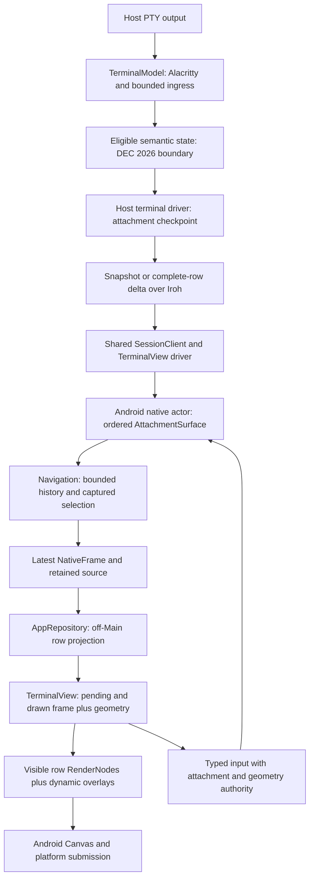

# Android review design

Baseline: `a2b518e61544642bb4537935e8fd6c192dff607b` (main, v0.1.31),
2026-09-09. This document specifies the review boundaries and candidate directions.
The user subsequently approved the row-level local-response increment; its actual
scope and validation are in [research/first-build.md](research/first-build.md).
Findings and evidence are in
[research/review.md](research/review.md).

The latest approved increment unifies live-screen IME policy: signed height
movement with a visible-caret top boundary, early known targets and held actual
presentation on both screens. Screen **changes** still fence source handoff.
`research/unified-ime.md` specifies this Android-only boundary and the actual
host layout differences that remain authoritative. It supersedes earlier
main-screen placement and scheduling exceptions in the historical sequence below.

The user's follow-up makes keyboard-driven TUI resize the priority. They locate
the pause after keyboard arrival and specify local row movement followed by
remote reconciliation against that moved display. The concrete presentation,
cache and complementary scheduling proposal is in
[research/tui-ime-resize.md](research/tui-ime-resize.md).
Other findings remain independent follow-ups rather than an automatic bundle.

Phone feedback on the first build extends the local anchor rule: export the
existing authoritative active screen to Android, then bottom-anchor every live
alternate screen regardless of cursor visibility or occlusion. Keep main-screen
visible-caret placement. See `research/tui-bottom-anchor.md` for the missing
bridge metadata, application-neutral reproduction and correction evidence.
The next phone test confirms local anchoring but exposes the resize-only snapshot
between that local image and the child's repaint. The implemented Android early
target / retained-drawing increment and its limits are in `research/resize-handoff.md`.
The user confirms that increment is substantially better. The subsequent small
layout-phase correction and actual closing-target validation are recorded in
`research/ime-motion.md`; they preserve the existing handoff and renderer.
That cleanup did not improve the user's perceived motion. Physical-phone tracing
then found a render-cache boundary gap: display lists still replay substantial
glyph/background work on RenderThread. The next increment sets
`RenderNode.setUseCompositingLayer(true, null)` on the existing bounded immutable
row entries. It retains Android-managed row pixels without introducing another
cache owner or painter. Tests pass; five opening and six closing phone animations
confirm about 75% lower mean RenderThread Drawing cost. Main drawing/commit still
has an end-of-animation burst, and presentation cadence is not proven better.
See `research/ime-phone-trace.md` for the measured cost, live memory, remaining
owner-attribution gap and sample limits.

The user accepts retaining that implementation after the necessity review.
The next measured change stays inside `TerminalView.drawRow`: omit glyph
submission and foreground paint setup for empty strings and exact single ASCII
spaces, while preserving backgrounds, underlines and all other glyphs. Existing
row lifecycle and the full painter remain the rendering owners. Paired warmed
recording measurements improve sparse/decorated scenes with identical hardware
pixels; dense text remains essentially unchanged. `research/row-painter.md`
records this narrow boundary and excludes a phone-wide smoothness claim.

## Approved peer-adoption increment (2026-09-10)

Follow `research/peer-adoption.md`: source-to-source bounded row references at
UniFFI, display-paced selection of the latest already installed native frame,
and an evaluated narrow text-run experiment. The experiment is not adopted:
long-text work falls, but styled controls do not show reliable improvement. Preserve the unified IME rule and existing
host/model/wire owners. Pixel identity never supplies source/input authority.

## Actual ownership and data flow

| Boundary | Actual owner and source anchors | Review judgment |
| --- | --- | --- |
| Host terminal meaning | `crates/terminal/src/model.rs:198`, `:330`; `crates/terminal/src/projection.rs:120` | Preserve the sole host parser. Android receives semantic values. |
| Publication versus parsing | `crates/terminal/src/model.rs:228`; `.trellis/spec/backend/terminal-model.md:99` | Preserve DEC 2026 frozen reads and bounded recovery; transport chunks are not application frames. |
| Per-attachment delta baseline | `crates/terminal/src/model.rs:359`; `crates/client/src/surface.rs:28` | Validate each required revision before considering display coalescing. |
| Native synchronization and navigation | `crates/android/src/terminal.rs:720`; `crates/android/src/terminal/navigation.rs:44` | Shared driver owns wire recovery; native navigation owns local history, not another protocol. |
| Application lifetime | `apps/android/app/src/main/java/io/github/leonfox28/zterm/ZtermApplication.kt:5`; `AppRepository.kt:26` in the same directory | Appropriate for Activity recreation and best-effort background continuity. |
| Display ownership | `apps/android/app/src/main/java/io/github/leonfox28/zterm/AppRepository.kt:44`, `:247`; `TerminalView.kt:279` in the same directory | Preserve explicit source retention and drawn geometry; avoid moving input authority into Compose. |
| Platform rendering | `apps/android/app/src/main/java/io/github/leonfox28/zterm/TerminalRowRenderer.kt:10`; `TerminalView.kt:329` in the same directory | Keep bounded row display lists and complete draws as the baseline. |

## Separate identities

| Identity | What it proves | What it must not imply |
| --- | --- | --- |
| Host processing/published revision | Ordered model progress / one eligible semantic state | Application layout completion without a marker |
| Repository attachment epoch | Async work belongs to the selected native handle | Validity of every coordinate or cached glyph |
| Native `input_epoch` | Admission belongs to a synchronized interaction lifetime | Every resize should destroy composition |
| Native `geometry_generation` | Coordinates survive neither incompatible geometry nor A-B-A | A new keyboard connection is always needed |
| Native frame `generation` | A newer metadata/content publication exists | Text changed or a platform frame was submitted |
| `content_generation` | One exported row window and resolved color identity | An unchanged protocol revision is required for identical pixels |
| View geometry version and logical top | Coordinates match the committed drawing | Pending layout/frame coordinates are already visible |

The existing distinct identities solve real problems. Reducing them to one
revision would reintroduce stale input, Copy and resize failures. The optimization
opportunity is sharing immutable row content while preserving separate authority.

## Candidate architecture changes

### Current priority: local movement, then reconcile with the displayed result

| Change | Owner | Decision / observable result |
| --- | --- | --- |
| Move the displayed rows immediately | Existing View geometry/IME path and retained drawn source | Local clip/pan follows current available pixels even if remote content or target discovery is delayed |
| Reconcile against the moved presentation | Native frame/source publication, repository and View handoff | Mandatory install/ACK continues; compare in the current display geometry and adopt current source authority even for zero visual difference |
| Preserve compatible row display lists across row movement | `TerminalView` invalidation and `TerminalRowRenderer` | Matching moved content reuses drawing independently of its old row ordinal; real text/style/width/font changes remain visible |
| Retain each cached row's composited pixels | Existing API 29+ hardware row RenderNode | Avoid repeated unchanged glyph/background replay, with the same content/dimension identity, eviction and row bound; measure GPU memory and keep direct fallback painting |
| Optionally submit a reliable final grid early | Existing `ImeAnimationState`, `TerminalGridLayout`, `TerminalView` and repository size path | Complement the core behavior by overlapping remote work with keyboard motion; one request per unchanged target, final verification and latest-target reversal handling |
| Measure remaining preparation cost | Native projection, FFI and repository conversion | Use PERF-1 row-sharing work only if measurements justify expanding scope into shared row ownership |

The main display contract is local-first and does not wait for a known final IME
target, network reply or TUI redraw. Keep three concepts separate: authoritative
remote state, the actually displayed content/placement, and the newest prepared
candidate. Map the candidate into the same viewport geometry as the displayed
content before comparing. Apply wire deltas only to their authoritative baseline;
local movement never edits that baseline or runs another terminal reflow parser.

The initial proposal uses rows as the reusable text unit. For example, old rows
`A B C D` may be moved/clipped to display `B C D`; a remote target `B C D*` should
reuse `B` and `C` and update only `D*`. Its new ordinals must not force every row
to be recorded again. Store a bounded mapping from displayed row slots to reusable
render content, preserving the movement correspondence rather than matching only
old semantic ordinals. Exact render-key/content equality confirms reuse; hashes
may accelerate lookup but cannot establish equality or source authority alone.

Content comparison includes styled blanks, foreground/background, cell widths,
font/metrics and rendering configuration. Cursor, selection and preedit remain
separate overlays. Row reuse does not preserve old click/Copy authority: commit
the correct source and geometry even if every text row matches. Reversal derives
from the currently displayed baseline, with no round trip through an obsolete
intermediate target. Keep the drawn plus newest pending bound and mandatory ACKs.

This is a policy for preserving correct visible content and reducing repeated
recording. Android may still replay/composite cached content; API 26–28/software
or discarded display lists may need complete drawing. Replaying equal content
is visually consistent with the policy. Do not implement correctness by omitting
unchanged areas from a fresh Canvas frame and assuming its old pixels persist.
[Android display-list drawing model](https://developer.android.com/develop/ui/views/graphics/hardware-accel#android_drawing_models).

Cell-run refinement is deferred. A later implementation must invalidate complete
terminal glyph footprints, including both halves of wide cells, combining text,
old/new backgrounds and style changes. A Unicode code point is not a valid generic
damage unit. Measure whether reduced recording outweighs extra comparisons,
cache entries and submission overhead before choosing finer granularity.

The early-target path uses actual consumed insets and measured chrome/cell metrics,
not a remembered keyboard height. Compose already reads IME source/target insets;
their timing must be verified in this hierarchy. Unknown/interactive endpoints
fall back to final measurement. Keep existing in-flight/latest-desired resize
ordering; local animation identity must not become another protocol or input
authority. Do not emit interpolated grid sizes throughout the animation.

Receiving a target grid early must not expose an empty portion of the still-large
View. Continue bounded clip/pan of the drawn source until a compatible handoff;
prepare the latest candidate concurrently. Preserve snapshot/delta application
and exact ACK independently of drawing, stale coordinate fences, healthy input
composition, navigation ownership and resource bounds. Do not infer TUI layout
completion from snapshot dimensions, blankness, timers or a process name.

Snapshot is a transport/resynchronization decision. Equal row text can remain
reusable even when the new geometry arrives as a full snapshot. Separate visual
cache validity from semantic source and coordinate validity. The first scope
preserves the wire schema, host parser, Canvas renderer and compatibility floor.

This proposal targets latency placement and wasted work; it cannot guarantee that
network/TUI processing always finishes within the keyboard animation. Whole
transitions and keyboard-arrival-to-useful-layout time are the acceptance units,
with a neutral fixture and real Herdr evidence. Detailed cases and fallback rules
are in the focused research note; runtime verification remains open.

### Other independently reviewable improvements

1. **Reconcile desired attachment settings at adoption.** Apply the newest desired
   geometry and appearance to the exact adopted handle. Viewport already has this
   rule; appearance lacks it (IMPL-1). Keep one owner of desired values.
2. **Give gesture cancellation explicit state.** A cancelled child gesture must
   remain cancelled through UP/CANCEL. A small local gesture state helper is enough
   for IMPL-2; no general input framework is justified.
3. **Separate row content from source authority.** Reuse immutable row content
   across cursor-only revisions and unchanged rows of sparse updates. New sources
   still carry current revision/epoch/geometry, while old captured sources retain
   their exact text. Account shared allocations once and pinned lifetimes correctly.
4. **Extract only behavior with a testable owner.** If implementing these changes,
   an attachment-adoption helper and a cell painter with explicit render configuration
   are plausible boundaries. Moving all state into a new MVVM framework, another
   parser, or a second recovery loop has no supporting evidence in this review.

## Diff alternatives and decision criteria

| Option | Expected benefit | Cost and correctness conditions | Recommendation |
| --- | --- | --- | --- |
| Existing row delta + RenderNode reuse | Sparse network updates; reuse of unchanged recorded text | Still copies/project rows before display-list reuse; no zero-jank guarantee | Preserve as reference implementation |
| Immutable row sharing plus row content IDs | Less allocation, FFI conversion and row equality work for cursor/sparse TUI changes | Distinguish content from source authority; include colors, glyph/style/width and font configuration | Measure after isolating the reported resize wait; expand shared ownership scope only if justified |
| Projection at Android presentation opportunities | Avoid conversion for candidates superseded before a draw | Apply all protocol deltas/ACKs first; bounded latest candidate; retire skipped source handles | Evaluate with the row-sharing work; no fixed debounce |
| Alacritty damage-assisted host projection | Avoid projecting every unchanged host row | Host-only adapter; metadata/colors/resize and synchronized boundaries need independent coverage; per-attachment baselines remain authoritative | Later, only if host projection profiles justify it |
| Cell-run/tile wire patches | Fewer bytes for tiny changes in very wide rows | New schema/capability and validation; wide-cell overlaps, resync and replay complexity | Defer until byte measurements show a bottleneck |
| Retained bitmap or partial Canvas redraw | Potential reuse in specific measured scenes | Texture upload/memory, clipping, background/cursor/selection coverage and compatibility costs | No replacement proposal without evidence |
| SurfaceView/OpenGL/Vulkan renderer | More control over rendering if GPU submission dominates | New surface/IME/composition/lifecycle and font-atlas work; no benefit to upstream row copying | Not justified by current evidence |

The pinned engine exposes line damage and reset APIs. Treat damage as a host
projection optimization hint, not a portable wire contract or per-client ACK
baseline. User selection is outside that engine damage state.
[Alacritty 0.26.0 Term API](https://docs.rs/alacritty_terminal/0.26.0/alacritty_terminal/term/struct.Term.html#method.damage).

Android uses display lists for hardware drawing, so an invocation of a complete
draw is not by itself evidence of a separately visible clear. Correctness still
requires recording all needed content and invalidating changed state.
[Android drawing model](https://developer.android.com/develop/ui/views/graphics/hardware-accel#android_drawing_models).

## Compatibility and validation boundaries

- Preserve the existing semantic wire protocol and host authorization/controller
  lease model for local Android fixes and projection improvements.
- Keep native cache limits (4,096 rows / 16 MiB including pins), exported windows
  (three viewports plus one row), and bounded input/command queues.
- Keep API 26–28 and software rendering. A software Bitmap test does not verify
  the API 26–27 hardware underline path.
- Preserve exact snapshots/resume ACKs independently of Android draw timing.
- Keep input and selection barriers during actual reconnect, takeover, screen
  changes and detach. Do not queue disconnected input for replay.
- Accept unmarked application redraw intermediates as possible. Do not infer
  completion from blank/nonblank pixels, a timer, or a TUI process name.
- Future fixes should be independently reversible. Row sharing must be removable
  without changing protocol semantics; keep the complete-row painter as a
  correctness reference. No deployment or running daemon change belongs here.

## Review status

The static review, focused native validation and alternatives comparison are
recorded. Runtime gaps are explicit in `research/review.md` and `implement.md`.
The resize extension now has a concrete proposal and acceptance plan. Its stage
ordering is established from source; correlated device/host timings are pending.
No product decision is needed to accept this review artifact. A later product
increment beyond the approved first build still requires a concrete scope review.
The task is active for evaluation of the first build; broader candidate changes
are not bundled into it.
