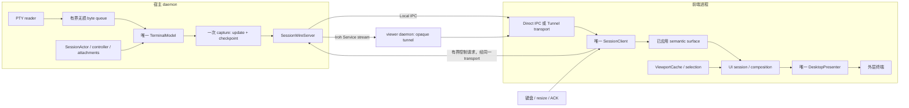

# Design: 明确所有权，消除重复工作

状态：2026-09-05 用户已确认架构方案，主代理已实施并验证；用户已确认提交并继续发布流程；工作提交为 `0c21738`。问题证据以 [架构审查](research/architecture-audit.md) 为准。

## 基本约束与取舍

用户需要的持续工作单元是宿主 Session；网络、CLI 和 view 可以重建。
由此保留四个不同所有者：宿主事实、前端已应用语义状态、客户端历史窗口、最后成功写到物理终端的画面。
它们表示不同时间点/投影，消除重复计算不能删除其中的必要边界。

图中客户端到服务端的控制箭头是逻辑路径；Remote 仍经过 viewer daemon 的 opaque tunnel 与 broker。

## D1：一个客户端控制操作截止时间（F1）

- 前端命令创建时确定 absolute deadline，贯穿命令队列 admission、transport write、相关控制响应等待。复用既有 5 秒默认控制窗口；detachment 保持既有更短的 UI 退出预算。
- command 携带截止时间；出队后已过期或调用方已离开的命令不能开始写入。History 仍是异步相关响应，不阻塞命令所有者。普通 `read_next_event` 在没有 pending control 时不设置 idle timeout。
- 等租约时，相关响应与 unsolicited events 由同一客户端解释和关联。暂存最多 8 帧，编码 payload 总量最多 `MAX_FRAME_BYTES`（8 MiB）；该数量与现有 view 事件队列一致，字节限制另行防止少数大帧占用过多缓存。超限返回 typed resource error 并关闭这个 epoch；不丢弃任意 terminal delta 后继续假装连续。
- 已开始的写入失败/超时/取消可能留下半帧。写入 future 临时持有整个 transport，成功后才移回；取消自动释放 socket。现有 write-half closure 仅保留 100 ms typed-outcome 读取机会，同时禁止再次写入。该 transport 必须作废并释放，后续只允许关闭或按既有 Remote resume 流程创建新 epoch。不可在半帧后重用旧 stream。
- 输入不重放；resize 保留最新意图；snapshot ACK 只描述前端已提交 revision；takeover 写出后的不可证结果保持 `OperationOutcomeUnknown`，不在新 lease 下重做同一操作。租约分配本身尚不是 takeover 已执行。
- 初始 create-main 的 post-write ambiguity 分类保持不变。可重连的 Remote view 继续重试连接；每次控制操作仍有自己的有限窗口。
- 不增加 supervisor、全局 watchdog 或新重试层。

## D2：一次捕获 update 与 checkpoint（F2）

模型新增/调整一个捕获入口，接受可选旧 checkpoint，同时返回 semantic Delta/Resync 与精确新 checkpoint。
内部只调用一次 `project`，使用同一份结果完成比较与 checkpoint 所有权转移；输出 revision 和新 checkpoint 必须相同。
driver 在原有模型锁内调用一次该入口。`sync_changed` 保留相等 revision 的早退；独立只读 snapshot/history 消费者继续使用对应 API。

初始、future/incompatible baseline、Main/Alternate 和几何变化仍返回完整替换；无需更改 wire-v2。
不引入模型共享屏幕缓存、跨附件 checkpoint 共享、dirty-row 世代或额外锁。

## D3：单次 semantic 候选构造与内容所有权转移（F3、F4）

- core 提供从 baseline + delta 构造完整验证候选的统一逻辑。UI 直接获取候选，消除“UI clone → core 再 clone”。保留所有行、宽字符、revision 和 metrics 不变量。
- 如 `apply_to` 仍有真实消费者，令其调用同一候选构造并一次赋值；不要保留两套校验/应用算法。对不合法 baseline 也应返回 typed error，不能依赖索引 panic。
- 候选只在 presenter 成功 write/flush 后提交，仍由 `apply_delta_with_writer` 的事务边界控制。hidden-history 更新同样遵守输入模式写失败时不提交的规则。
- snapshot/delta/history protobuf message 直接 move 到现有消费式转换函数。形状验证、attachment ID 和完整 originating query 检查保持原位。
- 初始 snapshot 随 prepared 阶段移交，运行态仅保存必要 revision/size/identity；删除无实际消费者的旧屏幕保留。UI 启动时需要的候选与 initial ACK barrier 仍须存在。
- 不变更公开 semantic DTO 为 `Arc`、不引入自定义 cell allocator 或通用 copy-on-write 层。

## D4：按实际运行职责整理模块（F5、F6）

在现有 `zterm-daemon` crate 内建立 `client` 边界：

| 模块 | 职责 |
| --- | --- |
| `client::transport` | Direct/Tunnel 建立、字节 I/O、envelope，失效 epoch 的释放 |
| `client::session` | 单一 Session client、resume、请求关联、控制 deadline、初始状态移交 |
| `client::view` | typed events/commands、8 槽通道、clipboard latest slot |
| `client::ipc` | unary LocalClient、PairingClient、DeviceClient 和响应解码 |
| `local_ipc` | 同 UID listener、first-frame ingress、服务端 dispatch；迁移期间仅保留必要导出 |
| `operations` | 命令用例、setup/lifecycle/target façade，调用 client；不另起附件协议状态机 |

模块是同一客户端边界的组成部分，不增加运行时跳转或第二个客户端对象。
只为现有真实调用保留 façade/re-export；未来移动端尚未实现，因此本轮不新增 crate 或宿主能力 feature matrix。

CLI 用一个具体的 `TerminalUiSession` 收拢现有状态和 transition 方法。
保留 `AttachmentSurface`、`ViewportController`、`SelectionController`、`DesktopPresenter` 的各自职责。
事件入口捕获同步状态，处理候选和副作用，成功后提交；对 resize/ACK 的决定不能回读本事件已经改写的状态。
优先移动有重复调用顺序的转换，避免只拆文件而继续传递同样的十多个参数。

## 兼容性、验证与回退

- CLI 语法、wire-major、ALPN、Session/attachment/resume identity、持久存储格式不变。
- Local 仍不 self-dial；Remote 仍复用 daemon 的 Endpoint/peer connection，每个 view 独立 service stream。
- source/layout 修改与行为修正分步验证，任一步都可以回退其源码/API 调整，无数据迁移或线上部署。
- 必须保留 strict snapshot ACK、takeover/operation replay、final drain、host effect 非重放、history query correlation 和失败时不提交的测试。
- 性能验收是消除指定完整投影/深复制/旧屏幕保留，不能宣称未经测量的 FPS、延迟或 CPU 提升。
- actor 异步化、10 ms child poll 替换、满 history 精确 eviction、共享 row cache 均推迟；它们需要独立失败/收益证据。
